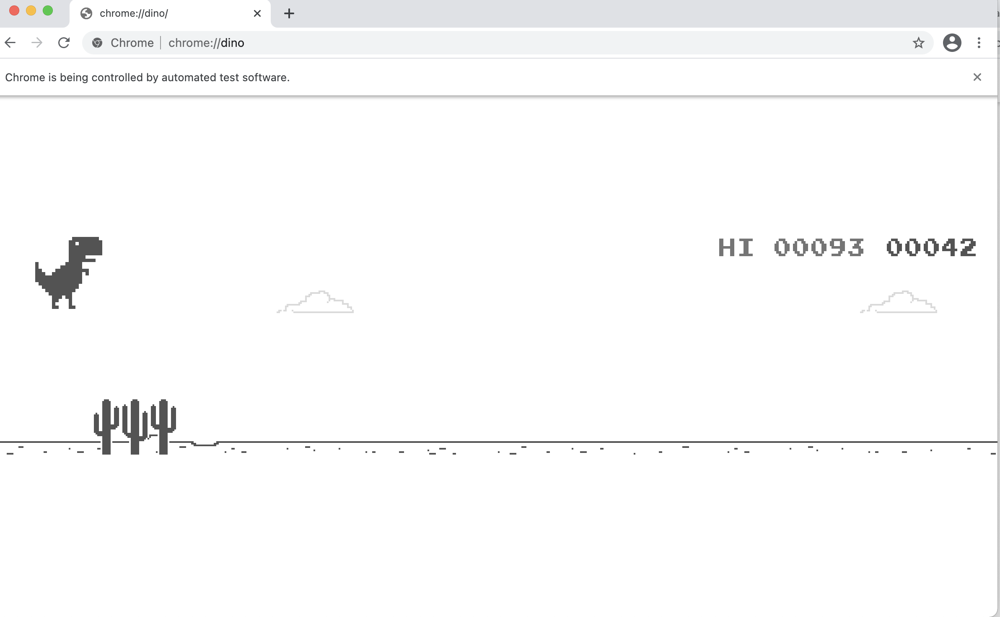

# reinforced-dino-runner

## Instructions

### 1. Installing Dependencies
Can be installed using `pip install` **or** `conda install` for *Anaconda environment*

- Python 3.7 
- Libraries 
  - numpy (1.17.0)
  - pandas (0.24.2)
  - keras (2.3.1)
  - tensorflow (2.0.0)
  - Selenium (3.141.0)
  - OpenCV (4.5.1.48)
- Driver
  - ChromeDriver 
    - Find out Chrome version **( settings -> About Chrome )**
    - Download driver (link - https://chromedriver.chromium.org/downloads)
    - Extract and paste `chromedriver.*` file into the **driver** folder
    - Change the path of chrome driver accordingly in Game.py (**Default** ="./driver/chromedriver")
    
### 2. Running Agent

Run `reinforced_dino_runner.ipynb` file. 

**Note:** for the first run set `init_cache` variable as **True** and for rest of the runs set it back to **False**. Set `observe` variable as **True** or **False** for **observing** and **training** the model for the agent.

### 3. Viewing progress

Run `visualize_progress.ipynb` file.

**Note:** For running above notebook we need some objects that are stored in the form of files in output directory. Currently, we are saving all the necessary results every 100 iterations. Feel free to change the variable value in line number 250 of `reinforced_dino_runner.ipynb`

### 4. Screenshots

[comment]: <> ()

[comment]: <> ()

